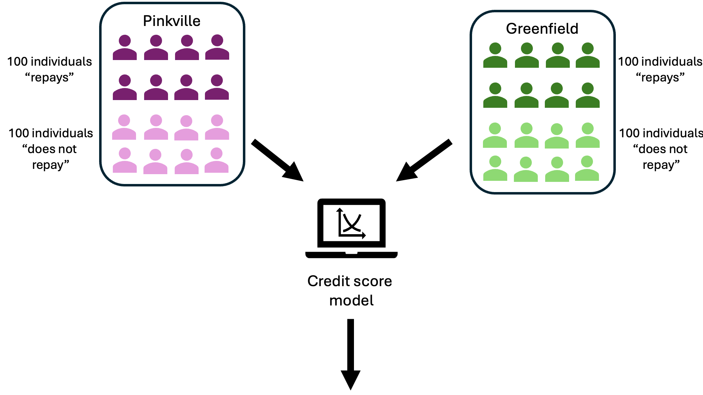

# Two Population Groups

## What do we really find in our data?

<!-- Include Font Awesome -->
<link href="https://cdnjs.cloudflare.com/ajax/libs/font-awesome/5.15.4/css/all.min.css" rel="stylesheet">

```js
import { translateData } from "./js/translateData.js";

const data = translateData(await FileAttachment("data/user/distribution.csv").csv({
  typed: true,
}));
```

So far, we have only differentiated the 400 individuals in our dataset by whether they are creditworthy (dark blue) or not (light blue).

```js
const fig = Plot.plot({
  width: 600,
  height: 200,
  style: {
    fontSize: 18,
  },
  x: {
    label: "Score",
    domain: [0, 99],
  },
  color: {
    legend: true,
    scheme: "Paired",
  },
  marks: [
    Plot.dot(
      data,
      Plot.stackY2({
        x: "score",
        fill: "type",
        sort: "type",
        sort: {
          value: "type", 
          reverse: false 
        },
        reverse: true
      })
    ),
    Plot.ruleY([0]),
  ],
});
display(fig);
```

Our dataset provides even more information. It includes two population groups, each differing in a key characteristic. This characteristic might be gender, ethnicity, or age (such as older versus younger individuals). In our specific example, we classify individuals according to their fictional origin: “Grünhausen” and “Pinklandia.”

Each group contains 100 creditworthy and 100 non-creditworthy individuals. Therefore, the probability of being creditworthy is identical in both groups.

Despite this, applying the credit score model leads to distinctly different score distributions for the two groups. This difference is evident in the graphics below.


```js
const fig_right = Plot.plot({
  width: 600,
  height: 200,
  style: {
    fontSize: 18,
  },

  x: {
    label: "Score",
    domain: [0, 99],
  },
  y : {
    domain: [0, 10]
  },
  color: {
    legend: true,
    domain: ["Repays", "Does not repay"],
    range: ["#33a02c", "#b2df8a"],
  },
  marks: [
    Plot.dot(
      data.filter((d) => d.age == "Young"),
      Plot.stackY2({
        x: "score",
        fill: "type",
        sort: "type",
        sort: {
          value: "type", 
          reverse: false 
        },
        reverse: true
      })
    ),
    Plot.ruleY([0]),
  ],
});

const fig_left = Plot.plot({
  width: 600,
  height: 200,
  style: {
    fontSize: 18,
  },

  x: {
    label: "Score",
    domain: [0, 99],
  },
  y : {
    domain: [0, 10]
  },

  color: {
    legend: true,
    domain: ["Repays", "Does not repay"],
    range: ["#6a3d9a", "#cab2d6"],
  },
  marks: [
    Plot.dot(
      data.filter((d) => d.age == "Old"),
      Plot.stackY2({
        x: "score",
        fill: "type",
        sort: "type",
        sort: {
          value: "type", 
          reverse: false 
        },
        reverse: true
      })
    ),
    Plot.ruleY([0]),
  ],
});
```


<div class="grid grid-cols-2">
  <div class="card" style="max-width: 700px; ">

```js
display(fig_left);
```
  </div>
  <div class="card" style="max-width: 700px; ">

```js
display(fig_right);
```

  </div>
</div>

<div class="tip" label="Task">
 <i class="fas fa-pencil-alt"></i>
  The bank decides to use your "optimal" decision threshold from the previous task for both population groups.
<ol type="a">
  <li>Find as many points of criticism as possible regarding this approach.</li>
  <li>Argue, from the bank’s perspective, why this might be a reasonable approach.</li>
</ol>
</div>
